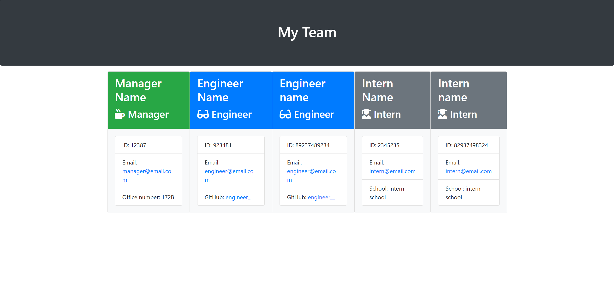
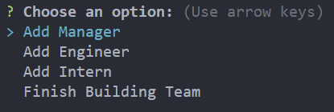
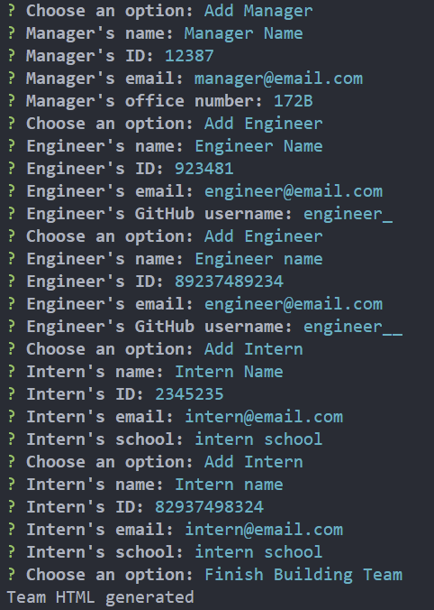

# Team Profile Generator
A simple team profile generator that is a command-line applicaiton that allows you to create a webpage which displays your team members. You can set roles to your team members such as Manager, Employee, and Intern. The application will then generate an HTML page with the given information. 

## Table of Contents
- [Installation](#installation)
- [Usage](#usage)
- [Screenshot](#screenshots)
- [License](#license)

## Installation 
1. Clone this repository to your local machine. 
    - ``git@github.com:lunar-potato/teamProfile-generator.git``
2. Navigate to the repository's directory on your machine.
3. Install the required dependencies on your terminal.
    - ``npm install inquirer@6.3.1``

## Usage 
After cloning the repository to your machine and downloading the dependencies needed, use your terminal to run the following command to use the application.

``node index.js``

Follow the prompts to add your team members and their roles. After finishing building the team, the application will then generate an HTML located in the **teamMembers** folder/directory. 

## Screenshots
Here is a screenshot of how the Team HTML output looks like 

 
The prompts looks like this

## Technologies
This application is written in 
- JavaScript (ES6)
- Node.js
- Inquirer.js
- Jest.js (for testing)

## License
This project is licensed under the MIT License - see the [LICENSE](LICENSE) file for more details. 